# WorkerXY Feature Gallery

This page showcases the various capabilities of the WorkerXY application.

## Main Interface

The WorkerXY Terminal User Interface (TUI) serves as the primary launchpad for interacting with the agent.

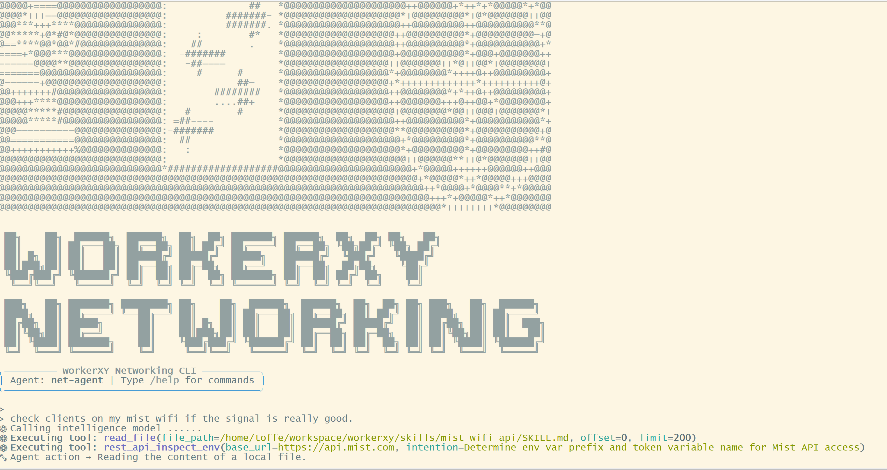
 
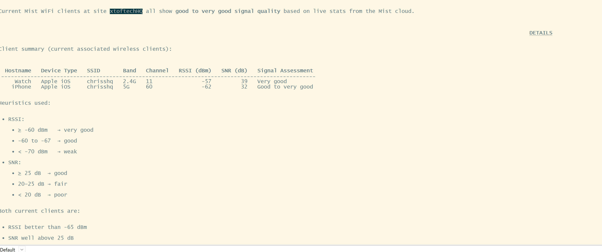
 

## Task Scheduling & Management

You can seamlessly schedule and manage tasks for the agents directly through the interface.

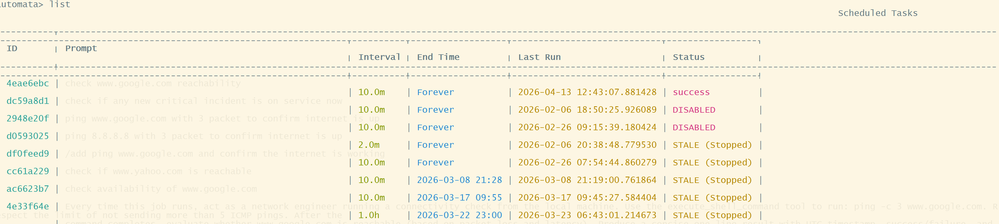
 

## Networking & Diagnostics

WorkerXY has deep integrations with network analysis and logging tools to aid in rapid troubleshooting and diagnostics.

### Syslog Analysis
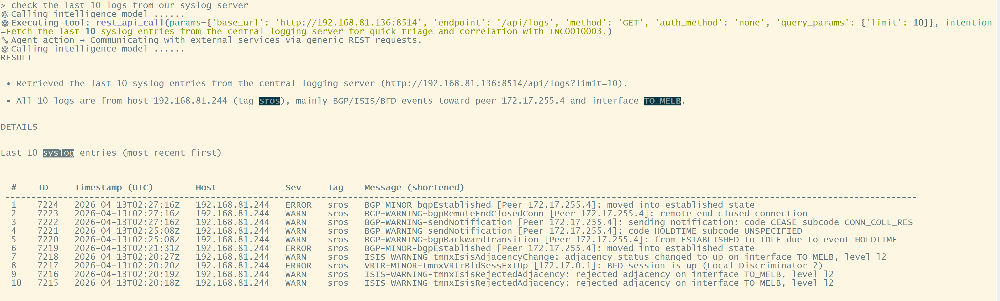
 

### Packet Analysis
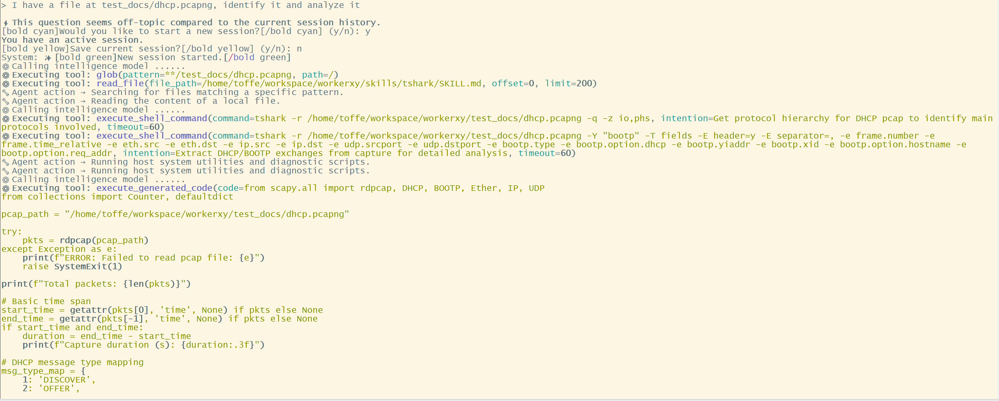
 
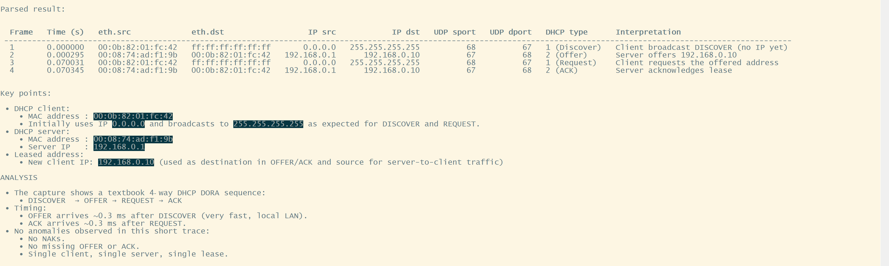
 

### Autonomous Network Diagnostics
*WorkerXY resolving a Jira ticket by autonomously reading network diagrams, extracting device management IPs, logging into devices to check BGP status, and updating the ticket with its findings.*

[🎬 Watch the WorkerXY BGP Autonomous Task video here](screenshots/workerXY_bgp_task.mp4)
 

## ITSM Integrations

The agents can interface directly with popular ITSM platforms to triage, update, and resolve tickets automatically.

### ServiceNow Incident Management
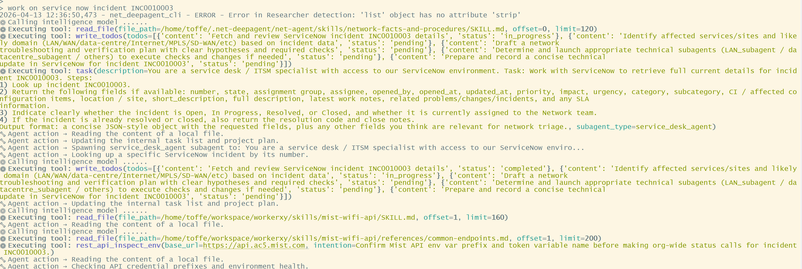
 

### Jira Ticket Management
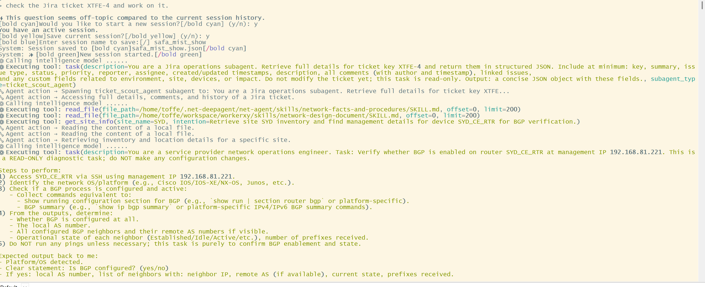
 

## ChatOps Integrations

WorkerXY natively integrates with instant messaging platforms so you can directly summon agents where your team already collaborates.

### Discord Integration
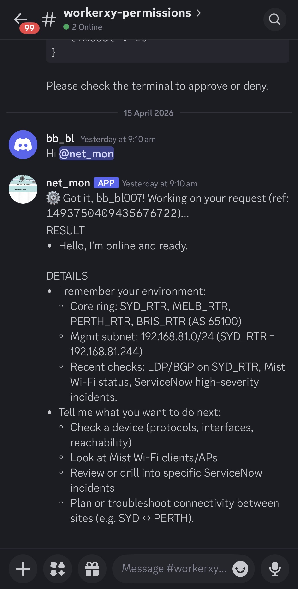
 

### Slack Integration
*WorkerXY requesting permission to proceed by informing the team directly in Slack.*
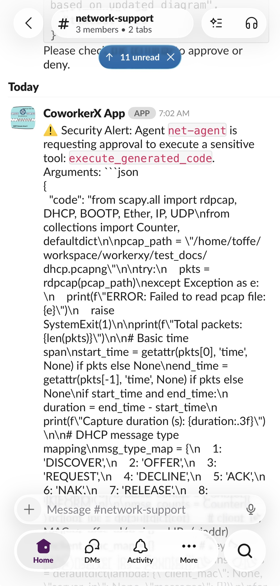
 

## Cloud Integration

WorkerXY can also interface with cloud services to run tasks on your cloud instance. 

### AWS S3 Data Analysis
*WorkerXY tackling a search and interpretation of data from an S3 bucket.*
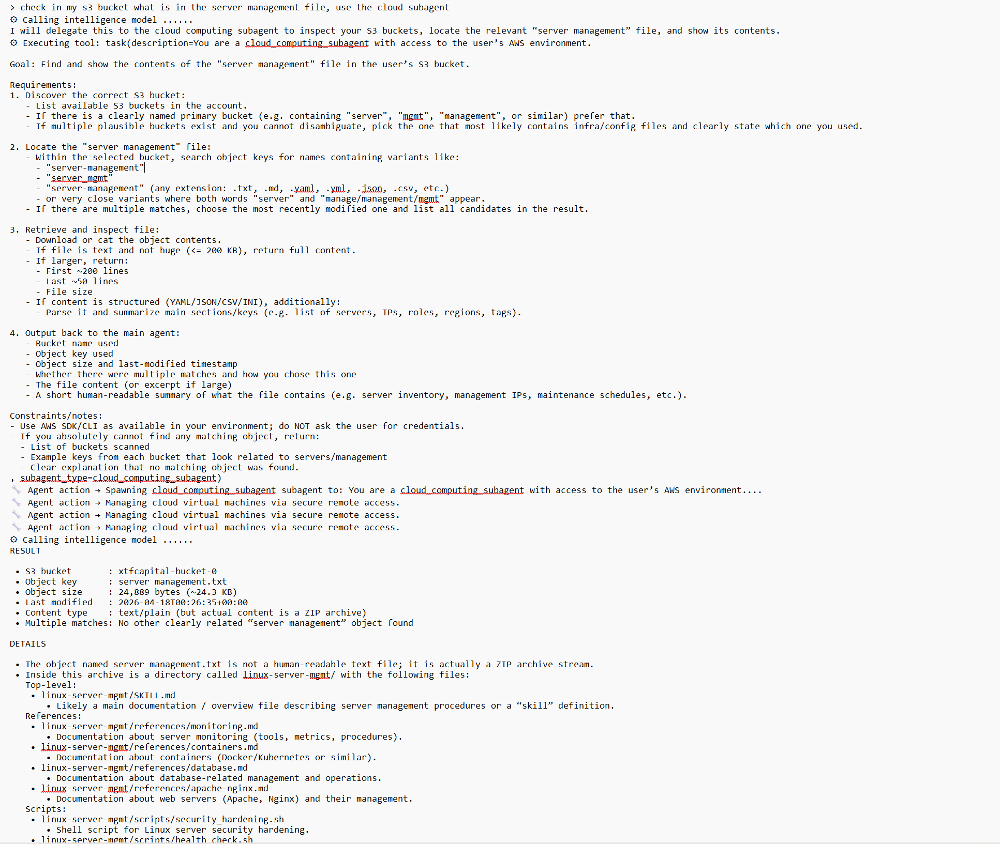
 

### AWS Lambda Monitoring
*WorkerXY monitoring the performance and logs of an AWS Lambda function.*
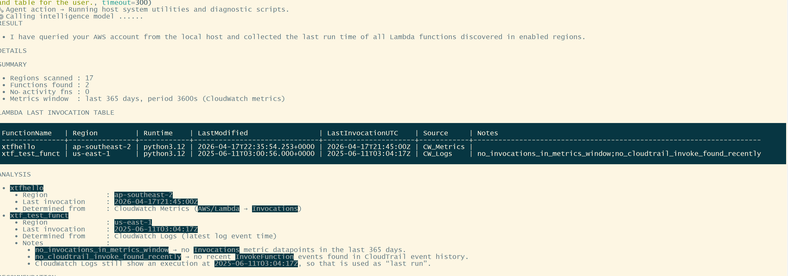
 
